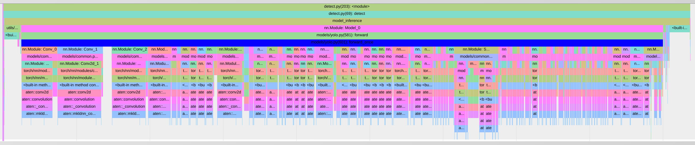
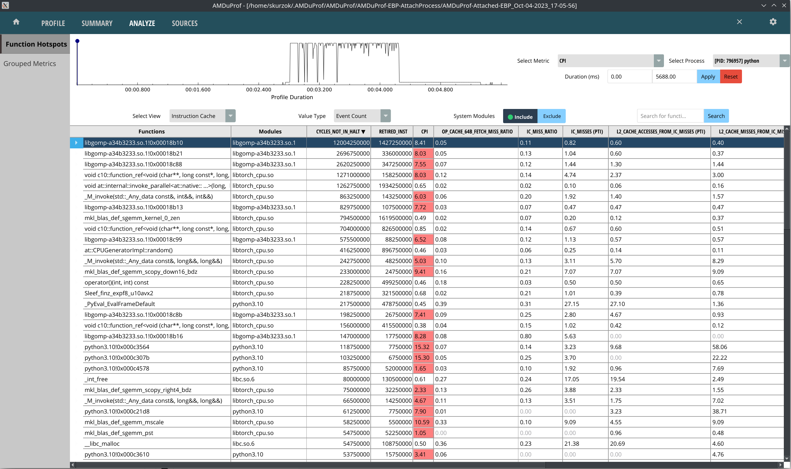

# setup enviriment

```
wget https://github.com/WongKinYiu/yolov7/releases/download/v0.1/yolov7.pt
virtualenv -p python3.10 venv
source venv/bin/activate
```
# run detection

python detect.py --weights yolov7.pt --conf 0.25 --img-size 640 --source inference/images

# tool: Torch profiler  https://pytorch.org/docs/stable/profiler.html#torch.profiler.profile

Profiling code is added to detect.py

```
(venv) ➜  yolov7 git:(main) ✗ python detect.py --weights yolov7.pt --conf 0.25 --img-size 640 --source inference/images/ --device cpu           
Namespace(weights=['yolov7.pt'], source='inference/images/', img_size=640, conf_thres=0.25, iou_thres=0.45, device='cpu', view_img=False, save_txt=False, save_conf=False, nosave=False, classes=None, agnostic_nms=False, augment=False, update=False, project='runs/detect', name='exp', exist_ok=False, no_trace=False)
YOLOR 🚀 v0.1-126-g84932d7 torch 2.0.1+cu117 CPU

Fusing layers... 
RepConv.fuse_repvgg_block
RepConv.fuse_repvgg_block
RepConv.fuse_repvgg_block
Model Summary: 306 layers, 36905341 parameters, 6652669 gradients
 Convert model to Traced-model... 
 traced_script_module saved! 
 model is traced! 

STAGE:2023-10-04 11:43:44 709072:709072 ActivityProfilerController.cpp:311] Completed Stage: Warm Up
/home/skurzok/projects/neureality/yolov7/venv/lib/python3.10/site-packages/torch/functional.py:504: UserWarning: torch.meshgrid: in an upcoming release, it will be required to pass the indexing argument. (Triggered internally at ../aten/src/ATen/native/TensorShape.cpp:3483.)
  return _VF.meshgrid(tensors, **kwargs)  # type: ignore[attr-defined]
4 persons, 1 bus, 1 tie, Done. (165.0ms) Inference, (0.8ms) NMS
 The image with the result is saved in: runs/detect/exp9/bus.jpg
5 horses, Done. (121.4ms) Inference, (0.6ms) NMS
 The image with the result is saved in: runs/detect/exp9/horses.jpg
2 persons, 1 tie, 1 cake, Done. (151.9ms) Inference, (0.6ms) NMS
 The image with the result is saved in: runs/detect/exp9/image1.jpg
2 persons, 1 sports ball, Done. (134.0ms) Inference, (0.6ms) NMS
 The image with the result is saved in: runs/detect/exp9/image2.jpg
1 dog, 1 horse, Done. (125.9ms) Inference, (0.6ms) NMS
 The image with the result is saved in: runs/detect/exp9/image3.jpg
3 persons, 1 tie, Done. (112.8ms) Inference, (0.6ms) NMS
 The image with the result is saved in: runs/detect/exp9/zidane.jpg
STAGE:2023-10-04 11:43:45 709072:709072 ActivityProfilerController.cpp:317] Completed Stage: Collection
STAGE:2023-10-04 11:43:45 709072:709072 ActivityProfilerController.cpp:321] Completed Stage: Post Processing
---------------------------------  ------------  ------------  ------------  ------------  ------------  ------------  --------------------------------------------------------------------------------  
                             Name    Self CPU %      Self CPU   CPU total %     CPU total  CPU time avg    # of Calls                                                                      Input Shapes  
---------------------------------  ------------  ------------  ------------  ------------  ------------  ------------  --------------------------------------------------------------------------------  
                  model_inference        13.31%     120.047ms       100.00%     902.241ms     902.241ms             1                                                                                []  
                          forward         0.03%     262.000us        16.15%     145.713ms     145.713ms             1                                                            [[], [1, 3, 544, 640]]  
                          forward         0.06%     554.000us        14.22%     128.308ms     128.308ms             1                                                            [[], [1, 3, 480, 640]]  
                          forward         0.06%     506.000us        14.08%     127.075ms     127.075ms             1                                                            [[], [1, 3, 640, 480]]  
                          forward         0.06%     536.000us        13.35%     120.447ms     120.447ms             1                                                            [[], [1, 3, 640, 448]]  
                          forward        -0.00%      -9.000us        12.86%     116.050ms     116.050ms             1                                                            [[], [1, 3, 448, 640]]  
                          forward         0.06%     574.000us        11.98%     108.083ms     108.083ms             1                                                            [[], [1, 3, 384, 640]]  
                        aten::cat         2.52%      22.776ms         2.63%      23.731ms     179.780us           132                                                                          [[], []]  
               aten::_convolution         0.29%       2.638ms         1.58%      14.267ms      14.267ms             1  [[1, 32, 544, 640], [64, 32, 3, 3], [64], [], [], [], [], [], [], [], [], [], []  
               aten::_convolution         0.26%       2.352ms         1.35%      12.139ms      12.139ms             1  [[1, 32, 480, 640], [64, 32, 3, 3], [64], [], [], [], [], [], [], [], [], [], []  
---------------------------------  ------------  ------------  ------------  ------------  ------------  ------------  --------------------------------------------------------------------------------  
Self CPU time total: 902.241ms
```


# Using build-in YOLO layer's profiler

This profiler measures the time of each layer of the model. It runs each layer 10 times and reports average time. It uses https://pypi.org/project/thop/ to calculate number of MAC operations.
Columns meaning: mac - number of MAC operations (G), number of params, time, layer type

Profiling code is in yolo.py:614.

```
(venv) ➜  yolov7 git:(main) ✗ python detect.py --weights yolov7.pt --conf 0.25 --img-size 640 --source inference/images/horses.jpg --device cpu --no-trace --yolo_prof
Namespace(weights=['yolov7.pt'], source='inference/images/horses.jpg', img_size=640, conf_thres=0.25, iou_thres=0.45, device='cpu', view_img=False, save_txt=False, save_conf=False, nosave=False, classes=None, agnostic_nms=False, augment=False, update=False, project='runs/detect', name='exp', exist_ok=False, no_trace=True, yolo_prof=True)
YOLOR 🚀 v0.1-126-g84932d7 torch 2.0.1+cu117 CPU

Fusing layers... 
RepConv.fuse_repvgg_block
RepConv.fuse_repvgg_block
RepConv.fuse_repvgg_block
Model Summary: 306 layers, 36905341 parameters, 6652669 gradients
STAGE:2023-10-04 13:31:14 739983:739983 ActivityProfilerController.cpp:311] Completed Stage: Warm Up
       0.5       928      11.4ms models.common.Conv                      
       2.6     18560       6.9ms models.common.Conv                      
       5.3     36992       4.5ms models.common.Conv                      
       2.6     73984       2.8ms models.common.Conv                      
       0.3      8320       0.9ms models.common.Conv                      
       0.3      8320       0.9ms models.common.Conv                      
       1.3     36992       1.2ms models.common.Conv                      
       1.3     36992       1.2ms models.common.Conv                      
       1.3     36992       1.2ms models.common.Conv                      
       1.3     36992       1.2ms models.common.Conv                      
       0.0         0       0.2ms models.common.Concat                    
       2.3     66048       2.9ms models.common.Conv                      
       0.0         0       1.1ms models.common.MP                        
       0.3     33024       0.6ms models.common.Conv                      
       1.2     33024       1.7ms models.common.Conv                      
       1.3    147712       1.3ms models.common.Conv                      
       0.0         0       0.1ms models.common.Concat                    
       0.3     33024       0.5ms models.common.Conv                      
       0.3     33024       0.5ms models.common.Conv                      
       1.3    147712       1.0ms models.common.Conv                      
       1.3    147712       1.0ms models.common.Conv                      
       1.3    147712       1.0ms models.common.Conv                      
       1.3    147712       1.0ms models.common.Conv                      
       0.0         0       0.2ms models.common.Concat                    
       2.3    263168       2.2ms models.common.Conv                      
       0.0         0       0.6ms models.common.MP                        
       0.3    131584       0.5ms models.common.Conv                      
       1.2    131584       1.3ms models.common.Conv                      
       1.3    590336       1.5ms models.common.Conv                      
       0.0         0       0.0ms models.common.Concat                    
       0.3    131584       0.5ms models.common.Conv                      
       0.3    131584       0.5ms models.common.Conv                      
       1.3    590336       1.2ms models.common.Conv                      
       1.3    590336       1.2ms models.common.Conv                      
       1.3    590336       1.2ms models.common.Conv                      
       1.3    590336       1.2ms models.common.Conv                      
       0.0         0       0.1ms models.common.Concat                    
       2.3   1050624       2.4ms models.common.Conv                      
       0.0         0       0.3ms models.common.MP                        
       0.3    525312       0.7ms models.common.Conv                      
       1.2    525312       1.4ms models.common.Conv                      
       1.3   2360320       1.4ms models.common.Conv                      
       0.0         0       0.0ms models.common.Concat                    
       0.1    262656       0.4ms models.common.Conv                      
       0.1    262656       0.4ms models.common.Conv                      
       0.3    590336       0.5ms models.common.Conv                      
       0.3    590336       0.5ms models.common.Conv                      
       0.3    590336       0.5ms models.common.Conv                      
       0.3    590336       0.5ms models.common.Conv                      
       0.0         0       0.0ms models.common.Concat                    
       0.6   1050624       1.1ms models.common.Conv                      
       4.3   7609344       7.9ms models.common.SPPCSPC                   
       0.1    131584       0.3ms models.common.Conv                      
       0.0         0       0.2ms torch.nn.modules.upsampling.Upsample    
       0.6    262656       0.9ms models.common.Conv                      
       0.0         0       0.0ms models.common.Concat                    
       0.3    131584       0.5ms models.common.Conv                      
       0.3    131584       0.5ms models.common.Conv                      
       0.7    295168       0.7ms models.common.Conv                      
       0.3    147712       0.4ms models.common.Conv                      
       0.3    147712       0.4ms models.common.Conv                      
       0.3    147712       0.4ms models.common.Conv                      
       0.0         0       0.1ms models.common.Concat                    
       0.6    262656       1.0ms models.common.Conv                      
       0.1     33024       0.3ms models.common.Conv                      
       0.0         0       0.1ms torch.nn.modules.upsampling.Upsample    
       0.6     65792       0.9ms models.common.Conv                      
       0.0         0       0.1ms models.common.Concat                    
       0.3     33024       0.6ms models.common.Conv                      
       0.3     33024       0.6ms models.common.Conv                      
       0.7     73856       0.7ms models.common.Conv                      
       0.3     36992       0.4ms models.common.Conv                      
       0.3     36992       0.4ms models.common.Conv                      
       0.3     36992       0.4ms models.common.Conv                      
       0.0         0       0.1ms models.common.Concat                    
       0.6     65792       1.0ms models.common.Conv                      
       0.0         0       0.2ms models.common.MP                        
       0.0     16640       0.2ms models.common.Conv                      
       0.1     16640       0.4ms models.common.Conv                      
       0.3    147712       0.5ms models.common.Conv                      
       0.0         0       0.1ms models.common.Concat                    
       0.3    131584       0.5ms models.common.Conv                      
       0.3    131584       0.6ms models.common.Conv                      
       0.7    295168       0.7ms models.common.Conv                      
       0.3    147712       0.4ms models.common.Conv                      
       0.3    147712       0.4ms models.common.Conv                      
       0.3    147712       0.4ms models.common.Conv                      
       0.0         0       0.1ms models.common.Concat                    
       0.6    262656       0.9ms models.common.Conv                      
       0.0         0       0.1ms models.common.MP                        
       0.0     66048       0.2ms models.common.Conv                      
       0.1     66048       0.3ms models.common.Conv                      
       0.3    590336       0.6ms models.common.Conv                      
       0.0         0       0.0ms models.common.Concat                    
       0.3    525312       0.6ms models.common.Conv                      
       0.3    525312       0.8ms models.common.Conv                      
       0.7   1180160       0.9ms models.common.Conv                      
       0.3    590336       0.5ms models.common.Conv                      
       0.3    590336       0.5ms models.common.Conv                      
       0.3    590336       0.5ms models.common.Conv                      
       0.0         0       0.1ms models.common.Concat                    
       0.6   1049600       1.4ms models.common.Conv                      
       2.6    328704       1.9ms models.common.RepConv                   
       2.6   1312768       1.8ms models.common.RepConv                   
       2.6   5246976       2.6ms models.common.RepConv                   
/home/skurzok/projects/neureality/yolov7/venv/lib/python3.10/site-packages/torch/functional.py:504: UserWarning: torch.meshgrid: in an upcoming release, it will be required to pass the indexing argument. (Triggered internally at ../aten/src/ATen/native/TensorShape.cpp:3483.)
  return _VF.meshgrid(tensors, **kwargs)  # type: ignore[attr-defined]
       1.0    457725       3.4ms models.yolo.Detect                      
107.5ms total
5 horses, Done. (2499.2ms) Inference, (0.9ms) NMS
```

Input resize time is below 0.5ms.

File `trace.json` generated by profiler, can be opened in any chromium browser using addres: chrome://tracing or on https://ui.perfetto.dev/.



We can see that bascially all leaf calls are made in MKL library and there is not much python overhead on top of them. After second convolution there is some overhead over MKL call, but it is in pytorch C++ implementation.

I also include output from scelene (profile.html) profiling, but it does not give any new information.

I've analyzed detection using AMD uProf. 



I found some function to have a hight CPI ratio. This is higher than I expected. It looks like waiting for memory. Unfortuantely this module is provided by PyTorch (it is a binary in virtual env) so I cannot collect stack traces from it (it does not have debus symbols nor is compiled with --fno-omit-frame-pointer).


Overall inference code in this project seems to be good. It will be difficult to speed it up it by some meaningfull value. Simple next step would be to try different runtime than Pytorch, ex: onnx-cpu. I've try to improve NMS (postprocessing) but with no measurable sucess, but rewriting it in c++ shuld speed it up.
